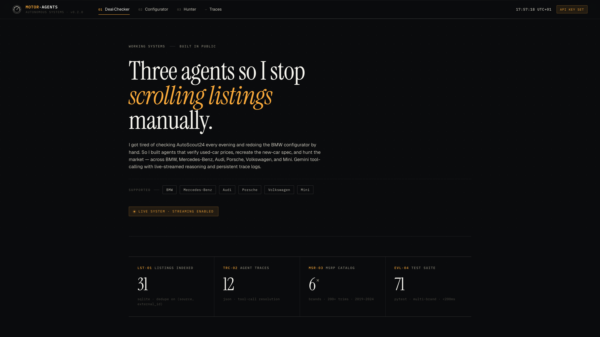
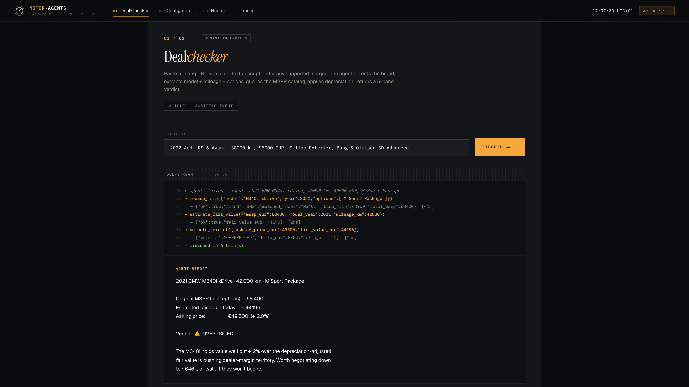
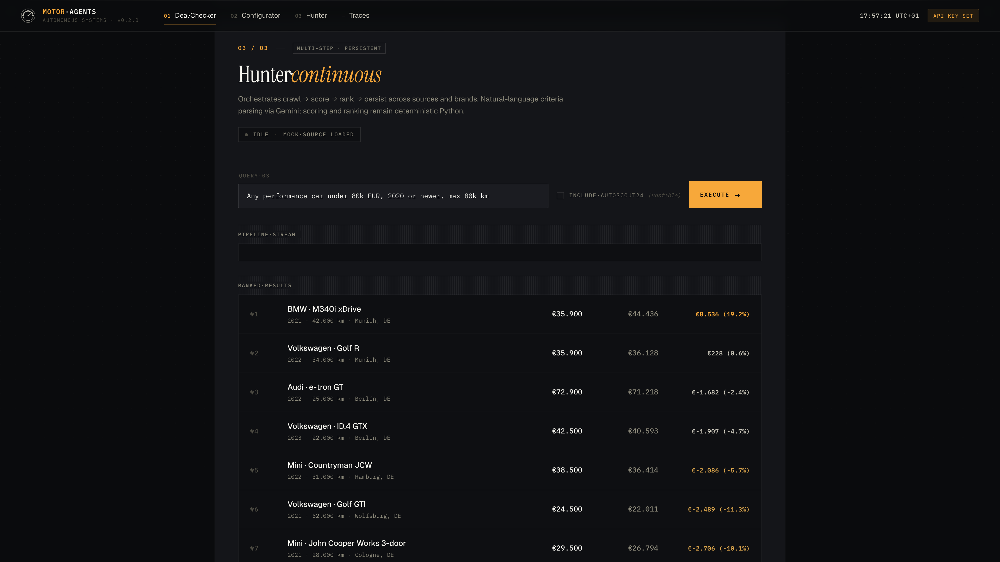

# Motor Agents



I got tired of scrolling AutoScout24 every evening trying to work out whether a used M340i was priced fairly, then hopping over to bmw.de to redo the configurator to see what the same car costs new. Same tedious workflow every single time — find listing, guess at fair value, look up new-car MSRP, compare, decide.

So I built three agents to do it for me. And since I wanted to actually learn how agents work (not just wire up a chatbot), I built them with real tool-calling, live-streamed reasoning, persistent trace logs, and a proper test suite.

They work across **BMW, Mercedes-Benz, Audi, Porsche, Volkswagen, and Mini**.

---

## The three agents

| Agent | What it does | Skill shown |
|-------|---|---|
| **1. Deal Checker** | Paste a used-car listing URL or a plain-text description → agent extracts the specs, queries an MSRP catalog, applies a depreciation model, and returns a 5-band verdict (STEAL / GOOD / FAIR / OVERPRICED / RIP-OFF) | Tool use, structured extraction |
| **2. Configurator Recreator** | Same input, but the agent opens the matching brand's *real* configurator in a headless browser and clicks through to recreate the spec | Browser-use agent, shadow-DOM navigation, vision fallback |
| **3. Used-Car Hunter** | Natural-language criteria ("any AMG under 80k, 2020+, max 60k km") → agent crawls listings, scores them, persists to SQLite, ranks the top 10 | Multi-step pipeline, scheduling, multi-brand filtering |

All three share one tool-calling loop, one trace recorder, and one Flask dashboard that streams every agent decision to the browser in real time over SSE.

---

## Demo

```bash
git clone <this-repo>
cd motor-agents

# 1. Get a free Gemini API key at https://aistudio.google.com/apikey
# 2. Create your own .env (the repo's .env is gitignored — your key stays local)
cp .env.example .env
# Edit .env and paste your GEMINI_API_KEY

pip install -r requirements.txt
playwright install chromium
python web/app.py        # open http://localhost:8001
```

> **Each person uses their own API key.** The `.env` in this repo is ignored by git,
> so cloners set their own `GEMINI_API_KEY` locally.

Or with Docker:

```bash
GEMINI_API_KEY=... docker compose up
```

---

## Architecture

```
┌─────────────────────────────────────────────────────────────┐
│              Flask Dashboard (web/app.py)                   │
│              · SSE streaming of tool calls                  │
│              · Trace viewer                                 │
│              · Hunter top-deals table                       │
└──────────────────┬──────────────────────────────────────────┘
                   │
     ┌─────────────┼─────────────┐
     ▼             ▼             ▼
┌──────────┐ ┌────────────┐ ┌──────────┐
│ Agent 1  │ │  Agent 2   │ │ Agent 3  │
│  Deal    │ │Configurator│ │  Hunter  │
│ Checker  │ │ Recreator  │ │          │
└──────────┘ └────────────┘ └──────────┘
     │            │              │
     └────────────┼──────────────┘
                  ▼
      utils/agent_loop.py
      (Gemini tool-call loop, shared)
                  │
     ┌────────────┴────────────────┬───────────────────┐
     ▼                             ▼                   ▼
┌──────────┐              ┌────────────────┐   ┌────────────┐
│  tools/  │              │ tools/browser_ │   │  hunter/   │
│ scraper  │              │    session     │   │  sources   │
│ msrp_    │              │ tools/vision_  │   │  scorer    │
│ lookup   │              │    picker      │   │  database  │
│ deprec.  │              │                │   │  report    │
└──────────┘              └────────────────┘   └────────────┘
   │                                                  │
   ▼                                               SQLite
data/msrp.json                                   (hunter.db)
(brand → model → year)
```

Every run produces a JSON trace in `traces/` with every tool call, arguments, result,
and duration. That's how the eval harness grades runs — against the trace, not the final
text. Same data shape that most observability platforms capture, but stored locally so
you can just grep it.

---

## How each agent works

### Agent 1 — Deal Checker



**Tools:** `fetch_listing`, `lookup_msrp`, `estimate_fair_value`, `compute_verdict`

The MSRP lookup is brand-aware. It auto-detects the brand from the query
("mercedes c300" → Mercedes-Benz, "Audi RS6" → Audi) or accepts an explicit `brand`
argument. The depreciation model combines three signals: an age curve, a mileage
adjustment (±% for above/below average km/year), and a model-family adjustment. It
recognizes performance trims (M, AMG, RS, Porsche S/Turbo, GTI, Golf R, JCW) and gives
them an +8% retention bonus; EVs (i-series, EQ, e-tron, Taycan, ID., Cooper SE) get
a -5% penalty, which is roughly what the market does through 2025.

```bash
python agent.py "2022 Audi RS 6 Avant, 38000 km, 95000 EUR, S line"
python agent.py "2023 Mercedes-Benz C 63 AMG S, 18000 km, 102500 EUR"
python agent.py "2021 Porsche 911 Carrera S, 48000 km, 108000 EUR, Sport Chrono"
```

### Agent 2 — Configurator Recreator

**Tools:** `open_configurator`, `navigate`, `get_page_snapshot`, `click_by_text`,
`click_link_by_href_contains`, `vision_click`, `scroll`, `take_screenshot`

The configurator tool takes a brand + country and opens the right regional site —
bmw.de, mercedes-benz.de, audi.de, porsche.com/germany, volkswagen.de, mini.de. The
agent has a three-tier click strategy: visible text → href slug → Gemini vision on a
grid-annotated screenshot when the DOM is opaque. I also had to add shadow-DOM aware
cookie dismissal because Mercedes uses Usercentrics, which renders its banner inside
a shadow root that normal Playwright selectors can't reach.

```bash
python agent_configurator.py "2022 Audi RS 6 Avant, Nardo Grey, S line, Germany"
python agent_configurator.py "2022 Mercedes-Benz C 300, Selenite Grey, AMG Line"
python agent_configurator.py --headed "..."   # watch the browser do it live
```

There's also a `pickers/bmw.py` module as a reference implementation for deep-config
EXACT selection — it uses shadow-aware selectors on `<con-swatch>` elements to pick a
specific color by name (e.g. "Alpine White" → BMW internal code `P0300`) and verifies
the selection by reading the updated configurator URL.

### Agent 3 — Used-Car Hunter



**Tools:** `parse_criteria`, `list_sources`, `search_source`, `score_listings`,
`save_to_db`, `rank_top`, `render_console_report`, `send_email_report`

Deterministic below the LLM layer. Gemini parses the criteria ("any AMG under 90k",
"Porsche 911 Carrera, 2020+") and chains the stages; the actual scoring, dedup, and
ranking are pure Python. There's a `--no-llm` mode that runs the whole pipeline
without any model call, so you can throw it in a cron job without worrying about token
usage or rate limits.

```bash
python agent_hunter.py "any AMG under 90k EUR, 2021+, max 60k km"
python agent_hunter.py "Audi RS 6 under 110k"
python agent_hunter.py --every 60 "..."      # loop every hour
python agent_hunter.py --no-llm              # deterministic, no API key
```

SQLite (`hunter.db`) handles dedup and price history with an `ON CONFLICT UPDATE` on
`(source, external_id)`. That way a daily run updates prices on ads you've already seen
instead of creating duplicates, and you can see "this deal has been up for 4 days at
the same price" which is arguably more useful than a fresh crawl.

---

## Data

`data/msrp.json` is brand-indexed:

```
brands:
  BMW:
    models: { M340i: { 2021: 64900, ... }, ... }
    option_packages: { M Sport Package: 3500, ... }
  Mercedes-Benz:
    models: { C 300: { ... }, C 63 AMG S: { ... }, ... }
    option_packages: { AMG Line: 3200, ... }
  ...
```

200+ trims across 6 marques, 2019–2024. Option packages are per-brand because every
manufacturer has their own branded bundles — M Sport is BMW-only, AMG Line is
Mercedes-only, S line is Audi-only, Sport Chrono is Porsche-only, R-Line is VW-only,
JCW is Mini-only. A flat schema would have made them interchangeable, which they
aren't.

---

## Tests + Evals

```bash
pytest                        # 71 unit tests, <200ms
python evals/run_evals.py     # end-to-end evals with pass/fail grading
```

The eval harness grades each case by inspecting the agent's **trace**, not its final
text. This is the thing I wanted to get right — "did the agent pick the right answer"
is easy to fake with a good-sounding final message. Checking the tool-call sequence
against expected behaviour is how you actually know.

```
════════════════════════════════════════════════════════════════════════
  EVAL SUMMARY
════════════════════════════════════════════════════════════════════════
  hunter                6/6 passed (100%)
  deal_checker          7/7 passed (100%)   (requires API key)

  TOTAL: 13/13
```

---

## Repo layout

```
motor-agents/
├── agent.py                  # Agent 1 entry point
├── agent_configurator.py     # Agent 2 entry point
├── agent_hunter.py           # Agent 3 entry point
├── tools/
│   ├── scraper.py            # requests + Playwright fallback
│   ├── msrp_lookup.py        # brand-aware fuzzy MSRP DB query
│   ├── depreciation.py       # brand-agnostic perf/EV classifier + age math
│   ├── browser_session.py    # persistent Playwright, multi-brand URLs
│   ├── vision_picker.py      # Gemini vision → click coordinates
│   └── listing_extractor.py  # free text → typed brand+config via JSON mode
├── hunter/
│   ├── sources.py            # MockSource + AutoScout24 adapter (brand-aware)
│   ├── scorer.py             # reuses Agent 1's math
│   ├── database.py           # SQLite upsert + history (brand column)
│   └── report.py             # console + HTML email
├── pickers/
│   └── bmw.py                # deep-config EXACT color/package picker (reference impl)
├── utils/
│   ├── agent_loop.py         # shared Gemini tool-call loop
│   ├── trace.py              # run-trace recorder
│   └── cli.py                # colored terminal output
├── web/
│   ├── app.py                # Flask + SSE dashboard
│   ├── templates/index.html  # dashboard UI
│   └── static/{style.css,app.js}
├── data/
│   ├── msrp.json             # 6 brands · 200+ trims · 2019–2024
│   └── mock_listings.json    # 30 seed listings across all 6 brands
├── tests/                    # 71 pytest unit tests
├── evals/                    # trace-based agent evals
├── traces/                   # JSON run logs
├── screenshots/              # Agent 2 output
├── Dockerfile, docker-compose.yml, pyproject.toml
└── requirements.txt, .env.example
```

---

## Things I learned building this

**Shadow DOM cookie banners are genuinely painful.** Mercedes uses Usercentrics,
which renders its consent modal inside a shadow root. Normal CSS selectors can't
cross shadow boundaries, so I had to write a JS traversal that walks every shadow
root looking for the "Accept All" button and clicks it via `element.click()` in
page context. After the four-tier dismissal strategy (selectors → iframes → visible
text → shadow-DOM JS injection), it finally closes on first try.

**LLM agents lie about their own progress.** The agent writes screenshot labels
like `color_selected.png` based on what it *thinks* it just did, not what's on
screen. Verifying screenshots after the fact is a real requirement. The dashboard
marks agent-authored labels as "claimed" rather than treating them as ground truth.

**Loop detection matters more than I thought.** Without it, the agent would try
the same failing click ten times in a row until it hit max_iters. Adding a
"if the same tool+args ran 3× consecutively, inject a nudge telling the agent to
write a report with what it has" was a one-hour fix that eliminated most "ran out
of turns" outcomes.

**Country-selector bounces are a per-brand quirk.** Porsche in particular sends
you to `/countries/?currentLocale=…` if you click certain nav elements. Detecting
this in the tool result + telling the agent "call navigate() back to your previous
URL" saved several runs.

**CLOSE vs EXACT tradeoff.** For the used-car analysis use case, reaching the
model page with a visible MSRP is the actual goal — the specific color and option
picks don't change the used-car valuation. So 10/10 CLOSE is the right ceiling.
The BMW picker is there as a proof-of-concept that deeper selection works, but I
didn't chase it across all brands because the ROI isn't there.

---

## Limitations + future work

- **MSRP data is a snapshot.** A real production version would pull live pricing
  from Schwacke / DAT / EurotaxGlass APIs rather than the static JSON.
- **AutoScout24 adapter is fragile.** Their anti-bot has gotten aggressive through
  2025. Works best from a residential IP; often fails from cloud/VPN ranges. The
  proper fix is their Business API or a scraping service.
- **Deep-config EXACT is only BMW.** Other brands reach CLOSE (model page + price
  visible). Extending EXACT to the other 4 brands is ~2-3h each of per-brand
  selector work — possible but brittle and not what this project is about.
- **No US-market pricing.** Current dataset is Germany/EU EUR. Parallel pricing
  trees for USD would double the data-gathering labor.

## License

MIT
